# 任务

* 学习 GO-MPC 论文

* 根据 github 源码分析实现的原理及结构

# 论文

## 场景描述

* 目标  
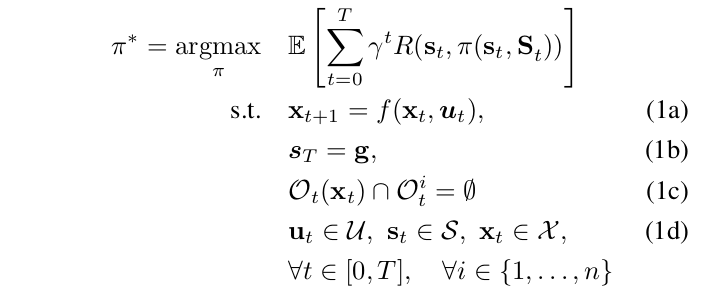  
   * ego-agent 学习策略 π 在确保无碰撞的同时最大限度的缩短到目标的时间
   * (1a) 表示 经过状态命令($u_t$)从当前控制状态($x_t$)的过渡动态约束
   * (1b) 约束的是 ego-agent 的最终状态 -> 最终的状态就是到达了目标点
   * (1c) 表示的 ego-agent 与周围的 agent 无碰撞(碰撞约束)
   * *U* -> 输入的集合(比如限制机器人的最大速度) *S* -> 允许的状态 *X* -> 允许的状态命令

* 运动模型  
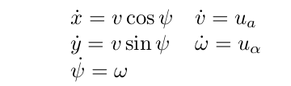  
   * 独轮车模型   
      -> 具有两个自由度 1. 控制车辆前后运动的线速度 2. 控制车辆转向的角速度   
      -> 独轮车可以视为一个质点
   * 其中 $x$ 和 $y$ 是 ego-agent 位置坐标
   * $\psi$ 是全局坐标系中的航向角
   * $v$ 是主体前进速度
   * $\omega$ 表示角速度
   * $u_a$ 表示线加速度
   * $u_{\alpha}$ 表示角加速度

* 对其他 agent 的建模
   * 主要采用两种方式
   * 合作策略(cooperative policy)   
      -> 采用 RVO 模型  
      -> 就是避免和其他 agent 产生碰撞
   * 非合作(non-cooperative policy) 对 ego-agent 向目标位置移动 造成阻碍   
      -> 1. CV policy(等速策略) 就是采用恒定速度向目标位置前进  
      -> 2. non-CV policy(非等速策略) 要么以正弦曲线的形式向目标位置移动 要么就是围绕初始位置做圆周运动

## 论文方法

* state  
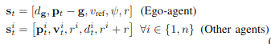
   * $d_g$ 当前位置距离目标位置的欧几里德距离
   * Other agent 中的 $d^i_t$ 表示 ego-agent 到第 $i$ 个 agent 的距离
   * 其他参数分表表示 参考速度($v_{reg}$)、线速度($v^i_t$)、角速度($\psi$)、半径($r$)

* 目标函数  
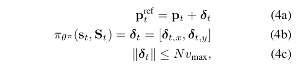
   * (4b) 位置增量($\delta_t, _x$, $\delta_t, _y$)
   * (4c) 限制位置增量($v_{max}$ 最大线速度) -> 确保下一个位置在 ego-agent 的规划范围内 应该就是保证路径合法且安全
   * (4a) 就是参考位置 -> $P^{ref}_t$ 由当前位置($P_t$) 经过位置增量($\delta_t$)更新得到

* 奖励机制  
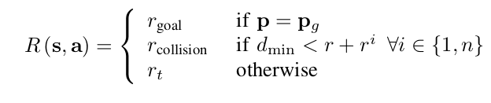
   * 对不同的情况设置奖励
   * 发生碰撞的情况作出惩罚 -> 判断发生碰撞的依据 -> ego-agent 与最近 agent的距离($d_{min}$)与它们的半径距离($r$ + $r^i$)作比较

* 防碰撞约束  
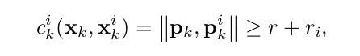
   * 防碰撞约束 -> ego-agent 和周围 agent 的欧式距离 与 它们之间的半径作比较

* 成本函数   
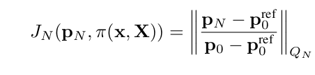
   * 注意 假设当前的时间步 **t 为 0**
   * $P^{ref}_0$ -> 参考位置由 subgoal recommender 提供 主要是引导 ego-agent 朝最终目标前进 同时最小化成本
   * $P_0$ -> ego-agent 真实位置
   * $P_N$ -> 第 $N$ 个点的位置？

* MPC 公式  
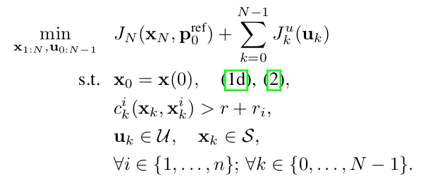

## 伪代码

* 主要是两个阶段 -> 1.监督学习 2.强化学习训练  
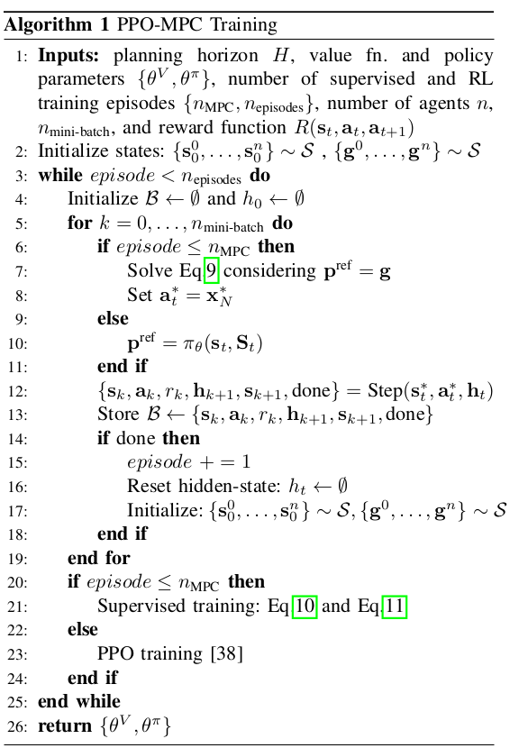
   * 对策略和价值函数进行随机初始化 {$\theta^{\pi}$, $\theta^V$}
   * 在每个 episode 开始时 在[1, $n_{agent}$]的范围内随机选择周围的 agent 的数量、训练的场景、周围 agent 的策略
   * 在 $n_{MPC}$ steps 使用 MPC 作为专家以及执行监督训练 -> 训练策略和值函数
   * 设置 MPC 目标状态作为 ego-agent 的最终目标状态($P_{ref}$ = g) 并求解 MPC 问题 -> 获得一个局部最优控制状态序列 $x^*_{1:N}$
   * 在每一个 step 定义 $a^*_t$ = $x^*_{t, N}$ 并储存一个元组在网络中 $\beta$ $\leftarrow$ {$s_k$, $a^*_t$, $r_k$, $h_k$, $s_{k + 1}$} 分别是下一个状态、控制状态、奖励、隐藏状态以及下一个状态
   * 计算优势估计并执行监督训练  
   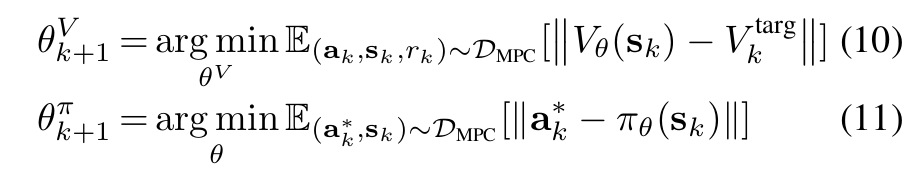
      * 训练值函数 $\theta^V$ 和策略 $\theta^{\pi}$ **除了自后一层 它们都共享参数** 如图所标记  
      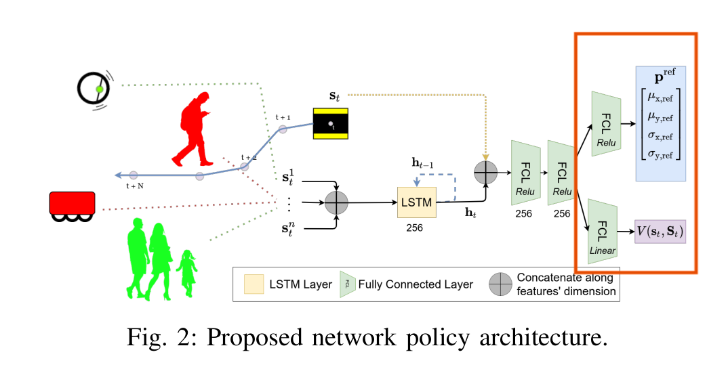
   * 使用 PPO 算法  通过裁减梯度来训练策略(PPO2 算法)

# 实现过程

* train.py
   * `model = ALGOS[args.algo]()` 创建模型；
   * 其中 `ALGOS[args.algo]` 代表算法名；
   * 如果继续训练通过 `model = ALGOS[args.algo].load()` 进行加载 `load()` 方法 通过继承 `ActorCriticRLModel` 实现；
   * 通过 `model.learn()` 方法来训练模型；
* ppo2mpc.py 
   * `__init__()` 中进行初始化 并通过 `self.setup_model()` 创建模型；
   * `learn()` 方法进行训练；
   * 部分参数说明 (来源于 PPO 解释文档)
      * policy -> 使用的策略模型(通过加载 yaml 文件)
      * env -> 学习的环境
      * n_step -> 每次更新每个环境运行的步骤数(即推出缓冲区大小为 n_steps * n_envs，其中 n_envs 是并行运行的环境副本数) 注意：n_steps * n_envs 必须更大比 1 (因为优势归一化)
      * gamma -> 折扣系数
      * clip_range -> 裁减参数 可以是当前剩余进度的函数(从 1 到 0)
      * clip_range_vf -> 值函数剪辑参数 这是特定于 OpenAI 实现的参数 如果传递 None (默认) 则不会对值函数进行裁剪 **重要提示：此裁剪取决于奖励缩放**
      * _init_setup_model -> 是否在创建实例时构建网络

## 源代码

### train.py

* 定义命令行参数并解析
* 在此程序中 通过对命令行输入的解析 来确定调用的算法库
* 从 yaml 文件加载超参数
* 根据所选算法创建 RL 算法对象
* 设置算法需要的 learning rate 和 schedules
这个代码提供了一个使用Stable Baselines库训练强化学习代理的脚本 代码导入了各种模块并定义了用于配置训练过程的命令行参数

以下是代码的主要组成部分的解析：

1. 导入必要的模块并设置环境：
   - `os.environ['CUDA_VISIBLE_DEVICES'] = '-1'` 禁用了 GPU 的使用
   - 导入了各种模块，包括 Stable Baselines 和其他自定义模块
   - 配置设置和环境的设置

2. 命令行参数解析：
   - 脚本使用 `argparse.ArgumentParser` 来定义和解析命令行参数
   - 可以提供参数来指定强化学习算法、环境、日志设置、训练代理文件、超参数等

3. 超参数设置和自定义：
   - 脚本根据选择的强化学习算法和环境从一个 YAML 文件中加载超参数
   - 超参数可以通过命令行参数进行覆盖

4. 训练设置和配置：
   - 脚本根据选择的强化学习算法和环境设置训练过程
   - 配置了时间步数、评估设置、日志目录、保存检查点和其他训练参数

5. 环境设置和初始化：
   - 脚本根据选择的强化学习算法和环境 ID 创建训练和评估环境
   - 还设置了环境的包装器或预处理器

6. 回调函数和日志记录：
   - 脚本定义了各种回调函数 如保存检查点和评估 在训练过程中执行
   - 设置了 TensorBoard 日志记录并保存了超参数和训练模型

7. 执行训练过程：
   - 在所有配置和设置步骤之后 脚本根据指定的时间步数开始训练循环
   - 训练进度根据配置的设置定期记录和保存

### ppo2-mpc.yml

这个YAML文件中包含了不同环境的强化学习算法的超参数配置 每个环境都有其对应的配置 以下是每个环境的超参数含义：

* `gym-collision-avoidance`: 使用 MlpLstmPolicy 算法 进行碰撞避免训练
* `atari`: 使用 CnnPolicy 算法 在 Atari 游戏上进行训练
* `Pendulum-v0`: 使用 MlpPolicy 算法 对 Pendulum-v0 环境进行训练
* `CartPole-v1`: 使用 MlpPolicy 算法 对 CartPole-v1 环境进行训练
* `CartPoleBulletEnv-v1`: 使用 MlpPolicy 算法 对 CartPoleBulletEnv-v1 环境进行训练
* `CartPoleContinuousBulletEnv-v0`: 使用 MlpPolicy 算法 对 CartPoleContinuousBulletEnv-v0 环境进行训练
* `MountainCar-v0`: 使用 MlpPolicy 算法 对 MountainCar-v0 环境进行训练
* `MountainCarContinuous-v0`: 使用 MlpPolicy 算法 对 MountainCarContinuous-v0 环境进行训练
* `Acrobot-v1`: 使用 MlpPolicy 算法 对 Acrobot-v1 环境进行训练
* `BipedalWalker-v3`: 使用 MlpPolicy 算法 对 BipedalWalker-v3 环境进行训练
* `BipedalWalkerHardcore-v3`: 使用 MlpPolicy 算法 对 BipedalWalkerHardcore-v3 环境进行训练
* `LunarLander-v2`: 使用 MlpPolicy 算法 对 LunarLander-v2 环境进行训练
* `LunarLanderContinuous-v2`: 使用 MlpPolicy 算法 对 LunarLanderContinuous-v2 环境进行训练
* `Walker2DBulletEnv-v0`: 使用 MlpPolicy 算法 对 Walker2DBulletEnv-v0 环境进行训练
* `HalfCheetahBulletEnv-v0`: 使用 MlpPolicy 算法 对 HalfCheetahBulletEnv-v0 环境进行训练
* `HalfCheetah-v2`: 使用 MlpPolicy 算法 对 HalfCheetah-v2 环境进行训练
* `AntBulletEnv-v0`: 使用 CustomMlpPolicy 算法 对 AntBulletEnv-v0 环境进行训练
* `HopperBulletEnv-v0`: 使用 MlpPolicy 算法 对 HopperBulletEnv-v0 环境进行训练
* `ReacherBulletEnv-v0`: 使用 MlpPolicy 算法 对 ReacherBulletEnv-v0 环境进行训练
* `MinitaurBulletEnv-v0`: 使用 MlpPolicy 算法 对 MinitaurBulletEnv-v0 环境进行训练
* `MinitaurBulletDuckEnv-v0`: 使用 MlpPolicy 算法 对 MinitaurBulletDuckEnv-v0 环境进行训练
* `HumanoidBulletEnv-v0`: 使用 MlpPolicy 算法 对 HumanoidBulletEnv-v0 环境进行训练
* `InvertedDoublePendulumBulletEnv-v0`: 使用 MlpPolicy 算法 对 InvertedDoublePendulumBulletEnv-v0 环境进行训练
* `InvertedPendulumSwingupBulletEnv-v0`: 使用 MlpPolicy 算法 对 InvertedPendulumSwingupBulletEnv-v0 环境进行训练
* `MiniGrid-DoorKey-5x5-v0`: 使用 MlpPolicy 算法 对 MiniGrid-DoorKey-5x5-v0 环境进行训练
* `MiniGrid-FourRooms-v0`: 使用 MlpPolicy 算法 对 MiniGrid-FourRooms-v0 环境进行训练

每个环境都指定了超参数 例如训练步数（n_timesteps）、策略（policy）、学习率（learning_rate）等 这些超参数将用于训练强化学习模型

### algorithm/ppo2

* 创建了一个 PPO2MPC 类 函数和类构成如下
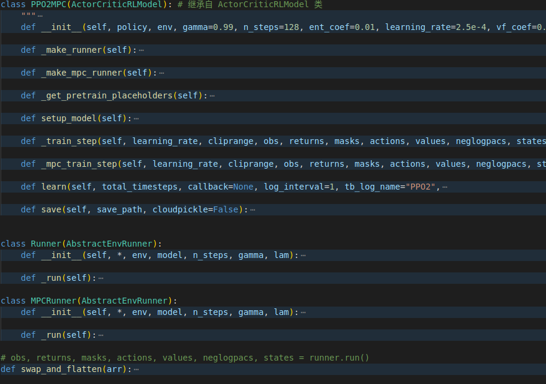

#### 功能分析

* 定义了一个名为 `PPO2MPC` 的类 它是 `ActorCriticRLModel` 的子类（Stable Baselines 中用于 Actor-Critic 模型的抽象基类）`PPO2MPC` 类实现了 PPO 算法 并使用 `MPCRunner` 类提供对模型预测控制（MPC）的额外支持

* 以下是代码的一些关键组成部分：

   - `__init__()` 方法定义了 `PPO2MPC` 类的构造函数 并初始化了各种参数 如学习率、剪切范围、熵系数等 它还设置了用于训练模型的 TensorFlow 图和会话

   - `setup_model()` 方法构建了 PPO 模型的计算图、创建了用于输入数据（观测、动作、优势等）的 TensorFlow 占位符、定义了用于训练模型的损失函数和优化器、创建一个 TensorFlow 计算图、建立训练操作和监督训练操作、根据策略是否为递归策略，设置每个步骤的批次大小和训练的批次大小

   - `Runner` 和 `MPCRunner` 类用于通过与环境交互收集经验 它们通过在环境中执行当前策略生成轨迹 并将收集的数据（观测、动作、奖励等）存储用于训练

   - `_train_step()/_mpc_train_step()` 方法执行 PPO 算法的单个更新步骤 它接收 Runner()/MPCRunner() 收集的数据批次 计算替代损失 并执行梯度下降更新模型的参数

   - `learn()` 方法是PPO算法的主要训练循环 它重复调用 `_train_step()/_mpc_train_step()` 方法以使用收集的数据执行多个更新步骤

* 具体代码实现
   * 在 **__init__()** 中除了初始化外 还调用了 **setup_model()** 方法
   * **setup_model()**
      * `act_model = self.policy(...)` -> 执行动作的模型
      * `train_model = self.policy(...)` -> 预训练模型
      * `self.approxkl = .5 * tf.reduce_mean(tf.square(neglogpac - self.old_neglog_pac_ph))` -> 计算新旧动作分布之间的近似 Kullback-Leibler（KL）散度(self.approxkl)
      * `self.step = act_model.step` -> 用于执行模型的推断步骤 产生一个动作和下一个状态
      * `self.proba_step = act_model.proba_step` -> 用于执行模型的推断步骤 产生一个动作及其对应的概率
      * `supervised_trainer = tf.train.AdamOptimizer(learning_rate=self.learning_rate_ph, epsilon=1e-5)` -> 创建了一个 Adam 优化器 是一种常用的优化算法 用于根据损失函数的梯度来更新模型的参数 以降低损失函数的值
      * `self.value = act_model.value` -> 用于评估模型对给定状态的值函数估计
      * `self.initial_state = act_model.initial_state` -> 用于获取模型的初始状态
   * 调用 **learn()** 方法 这部分可以参考伪代码
      * `rollout = self.mpc_runner.run(callback)` -> 调用 MPCRunner 类(继承自 AbstractEnvRunner 类)中的 **_run()** 方法 (首先调用的是 AbstractEnvRunner 类中的 run() 方法 再通过 run() 方法调用 _run() 方法)
         * 关于 **_run()** 方法 请查看 MPCRunner 类的描述
      * `self._mpc_train_step(...)` 进行 PPO2 算法训练 -> 返回两个值
         * 1.supervised_policy_loss -> 指在强化学习算法中使用监督训练进行策略学习时 计算得到的损失函数 它用于最小化监督训练阶段模型的参数
         * 2.clipfrac -> 用于衡量 actor 网络在更新策略后 新策略相对于旧策略的变化程度 它表示在更新策略后 每个样本的动作概率比起旧策略有多大程度的变化
   * **_mpc_train_step()** 方法 PPO2算法 计算梯度下降
      * `summary, supervised_policy_loss,  clipfrac, _ = self.sess.run([self.summary, self.supervised_policy_loss, self.clipfrac, self.supervised_train], td_map, options=run_options,  run_metadata=run_metadata)` -> `self.supervised_train` 操作就是用于执行梯度下降更新模型参数的操作

   * **MPCRunner 类**
      * `_run()` 方法主要是实现 -> MPC 监督学习 也就是论文描述的 warm-start 阶段
            * 1.从环境中获取代理对象 -> `agents = self.env.unwrapped.envs[0].env.agents`
            * 2.通过 ego-agent 的策略来获取随机动作 -> `actions, exit_flag = self.env.unwrapped.envs[0].env.agents[0].policy.mpc_output(0, agents)`
            * 3.添加动作 -> `mb_actions.append(actions)`
            * 4.保存状态 -> `mb_states.append(self.states)`
            * 5.在环境中执行动作 并获得 obs(新的状态) reward(奖励) done(标记这轮是否完成) info(一个提供额外信息的字典 取决于环境) -> `self.obs[:], rewards, self.dones, infos = self.env.step(clipped_actions)`
            * 6.碰撞检测 -> `if agents[0].in_collision:` 根据结果作出不同的奖励和惩罚 并选择更新还是不更新动作、选择是否减少步长、是否删除之前收集的数据
            * 7.最后对数据进行处理并返回

# 补充

## ppo(近端策略优化)算法原理

* 主要思想是通过限制每次更新的步长 使得策略的更新不会对旧策略产生影响 这样可以保证在更新策略网络时 新的策略和旧的策之间的差距不会太大
* 在训练过程中使用了一个价值网络来评估每个状态的价值函数 从而更准确地计算出回报函数
* 还采用了重要性采样的技术 使得算法可以利用以前的经验来更新策略网络
* PPO 算法是 Actor-Critic 算法的变体 Actor 和 Critic 都通过神经网络来实现(ActorCritic类) (而在本类中 通过 ActorCriticRLModel 来实现) Actor 网络用于学习和输出动作的概率 Critic 网络用来评估状态值(也就是评估这个动作的好坏)
* [算法原理参考](https://datawhalechina.github.io/easy-rl/#/chapter5/chapter5)

# 进阶任务

* 在训练场景中添加固定障碍物
   * idea
      * 按照论文描述 其他 agent 都具有一定的速度和半径(半径用于碰撞检测)
      * 所以是否可以将 other-agent 中的部分 agent 的速度设置为 0 来实现固定的障碍物？
      * 或者在场景中标记 $P$ 位置存在障碍物 并描述其碰撞区域？
   * 代码
      * Continually updated